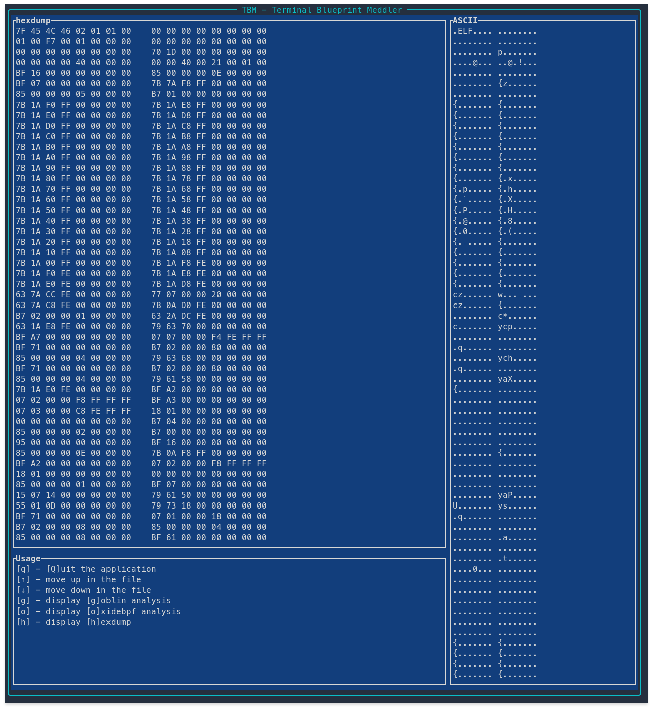

# TBM - Terminal Blueprint Meddler

A TUI application for fooling around inside eBPF files.

## Installation

```
cargo install tbm
```

## Usage

Currently, only prints out the binary and dumps a `ProgramBlueprint`
to the terminal. It must be run as root because `oxidebpf` requires
an enumerated kernel version for parsing blueprints.

```sh
$ sudo ./tbm --file /path/to/my_ebpf_program
```



## Wait, what's a blueprint?

Blueprints are what we call the processed and parsed eBPF objects
used by [`oxidebpf`](https://github.com/redcanaryco/oxidebpf). It
contains all the program's sections, details about its probes,
maps, and instructions, and more.
